# Visit My Cities

## Welcome! 👋

Thanks for checking out this bachelor's degree project.

<div>
  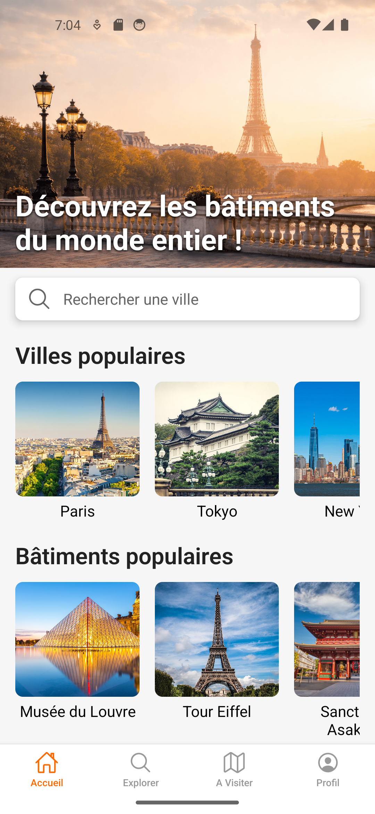
  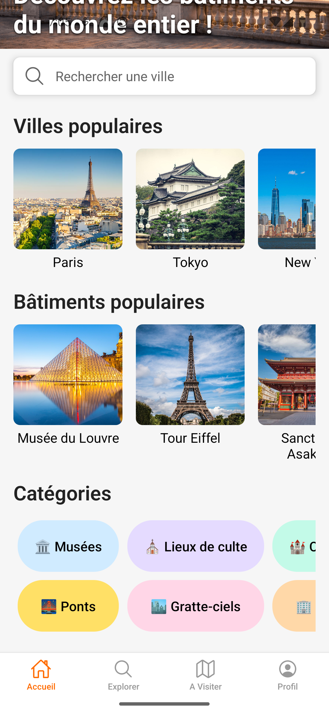
</div>
<br>
(More screenshots down below)

## The Project

The Visit My Cities project catalogs the various notable landmark in each city. A mobile application allows visitors to plan their visits during their time in a city. Visitors can view landmarks based on their preferences (year of construction, architectural style, categories). An expert user has the possibility to add new landmarks. Each landmark has plenty of useful informations to plan a visit.

## License ❗

- The source code is publicly visible for evaluation purposes only and may
  not be reused without explicit prior permission.
  
## Getting Started

### Running the Visit My Cities Application

To run the **Visit My Cities** application locally, you first need to start the database services using Docker. The project uses a container that includes **MySQL** and **phpMyAdmin**.

Start the containers with:

```bash
docker-compose up -d
```

This will launch the MySQL database as well as phpMyAdmin, allowing you to manage the database from your browser.

Once the database is running, start the REST API using a tool such as IntelliJ.

Once the containers and the REST API are running, you can start the front-end application.

From the frontend project directory:

```bash
npm install
npm run start
```

This will start the development server.

### Running the application

You can run the application in two different ways:

**1. Using Android Studio or iOS Simulator**
Open an Android emulator from Android Studio or an iOS simulator from Xcode and run the project. The app will automatically connect to the local development server.

**2. Using your physical phone**
If you want to run the application on your own phone, you must configure the environment variables correctly.

In particular, you need to replace the API_URL with **your computer's local IP address**, otherwise the phone will not be able to reach the server.

For example:

```
EXPO_PUBLIC_API_URL_TELEPHONE=http://192.168.X.X:8080
```
Once the environment variables are configured, restart the development server and scan the QR code (or run the app) from your device.

**The functionalities are :**
- Display a list of popular cities and landmarks
- Display a list of landmarks by category
- Display a list of landmarks by city
- Display detailed information for each landmark (address, opening hours, description, key information, visit information, location)
- Navigate between landmarks and cities within the application
- Maintain a list of favorite cities and landmarks
- Display a map with the landmark’s location
- Display a route from the user’s current location to the landmark using Google Maps
- Display a basic user profile once logged in
- Sign in and sign up functionality, with an admin area for expert users
- Add new landmarks via a form (front-end submission + back-end processing)

**The functionalities in building :**

- Add the favorite button on place cards
- Make the search bar work
- Add filter and sort functionality
- Create a V2 VisitScreen with the possibility to group landmarks by city
- Implement the planning functionality to create a route between landmarks in a city
- ProfileScreen with more information (editing personal details)
- Make a more elaborate external back-office, or add delete and edit functionality for landmarks and cities
- Add a full-screen map in BuildingDetailScreen to show the user’s current location
- Add the possibility to open a route with Apple Maps
- Allow users to suggest a new landmark
  
**Stacks used :**
- React Native (TypeScript, Zustand, Expo, React Hook Form)
- Spring Boot
- MySQL
- PhpMyAdmin
- Postman
- Docker

## Screenshots : ##

<div>
  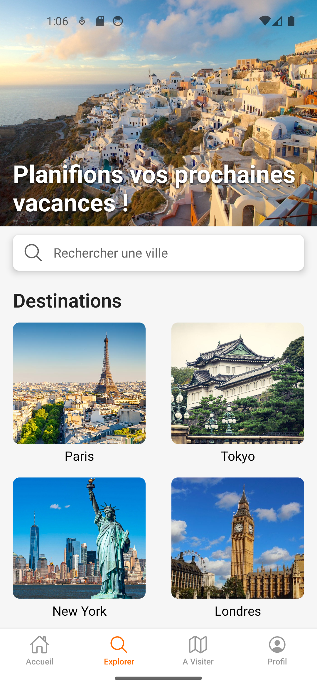
  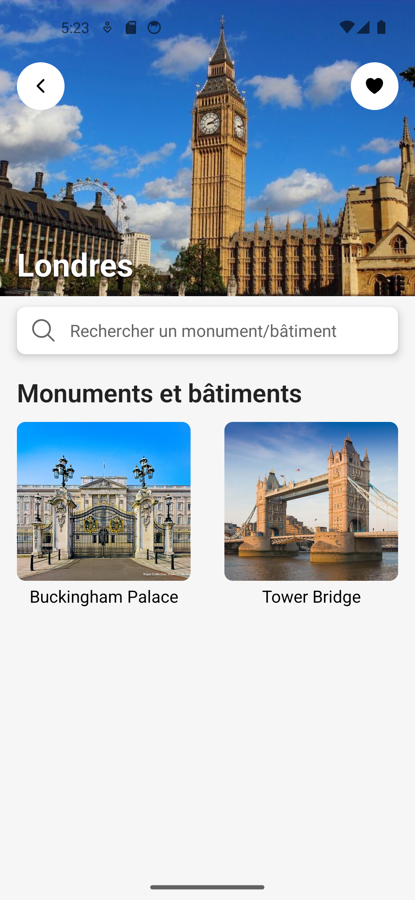
</div>
<br><br>
<div>
  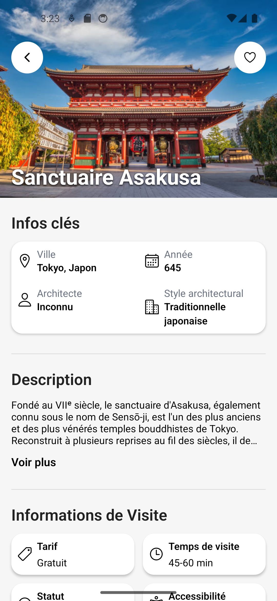
  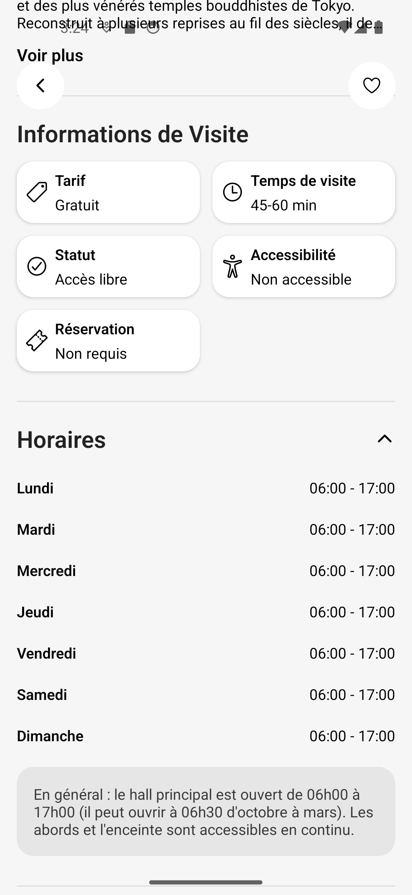
  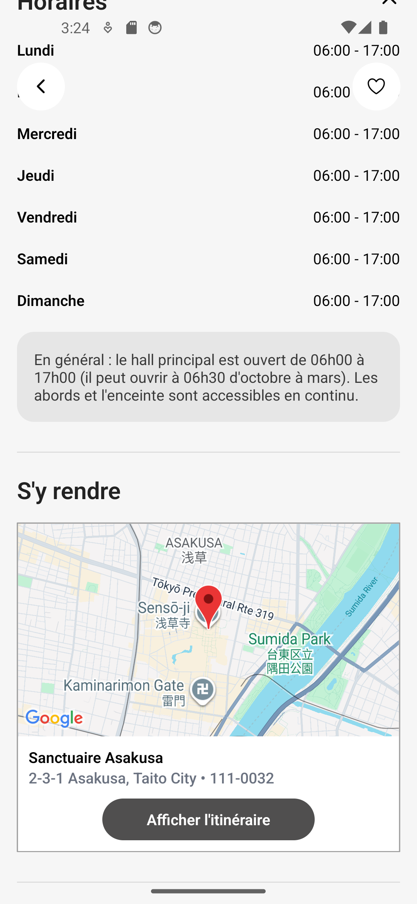
</div>
<br><br>
<div>
  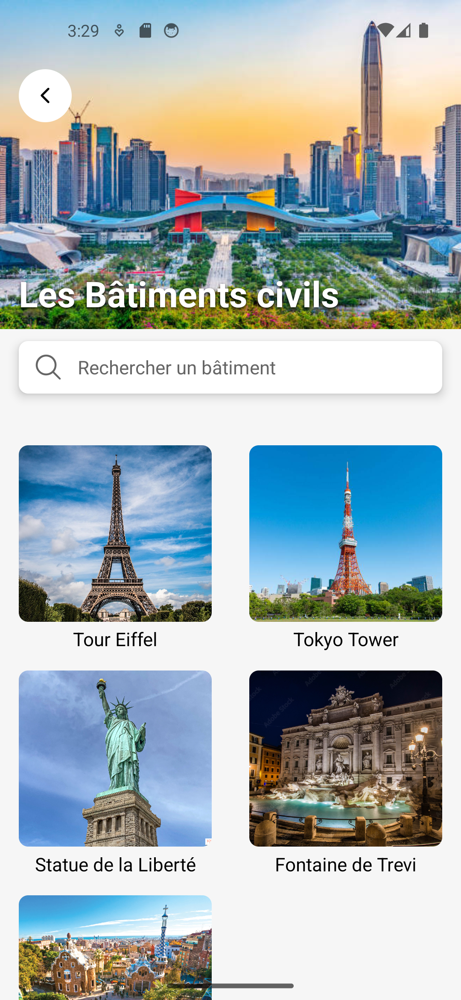
  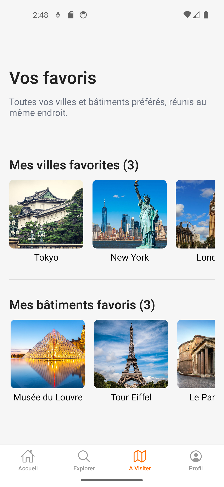
</div>
<br><br>
<div>
  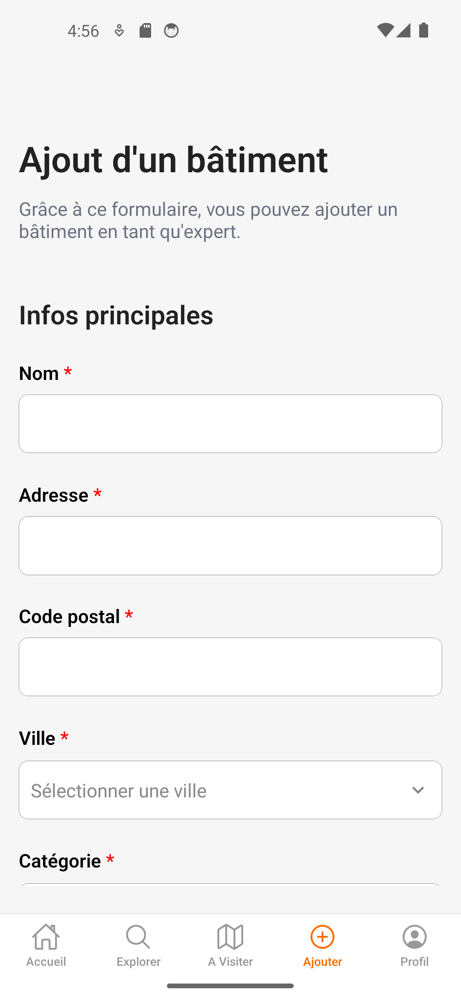
  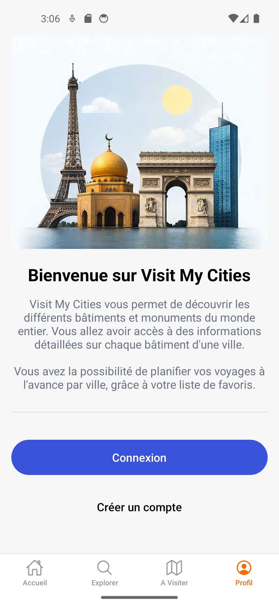
  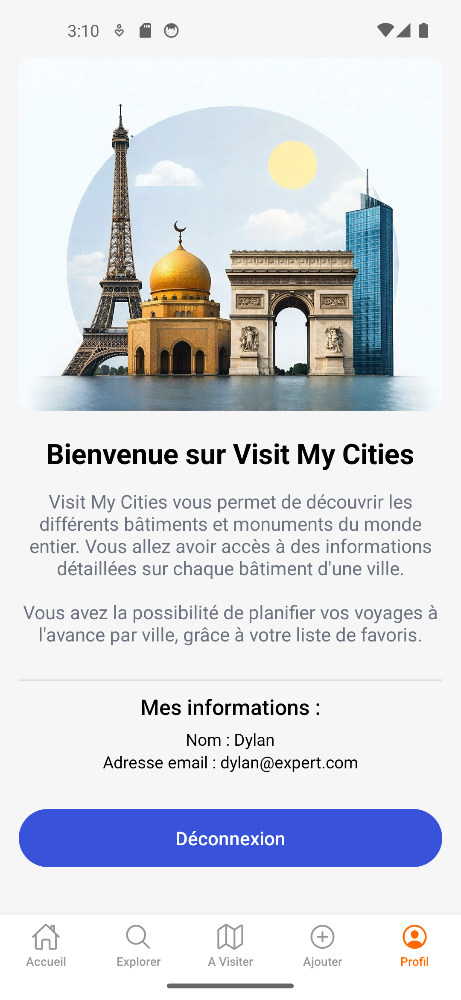
</div>


